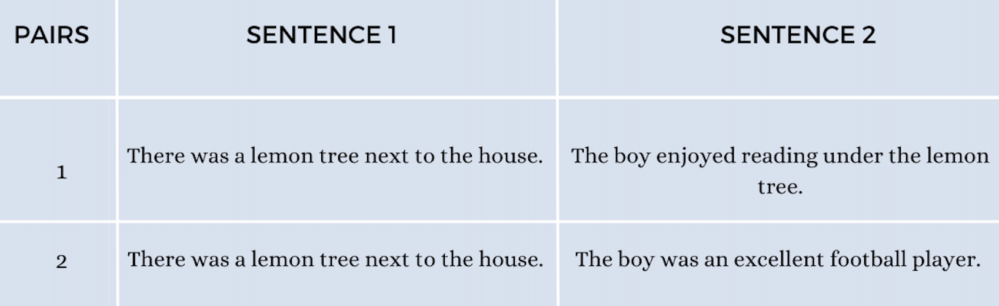

#   **SemEval 2024 Task 1: Semantic Textual Relatedness (STR)** 
---
A shared task on automatically detecting the degree of semantic relatedness between pairs of sentences. New textual datasets will be provided for Afrikaans, Algerian Arabic, Amharic, English, Hausa, Hindi, Indonesian, Kinyarwanda, Marathi, Moroccan Arabic, Modern Standard Arabic, Punjabi, Spanish, and Telugu.

---
 Part of the [18th International Workshop on Semantic Evaluation](https://semeval.github.io/SemEval2024/tasks.html)

<!-- 

 -->

 Contact organizers at [semrel-semeval-organisers@googlegroups.com](mailto:semrel-semeval-organisers@googlegroups.com)

 [Competition Website](https://codalab.lisn.upsaclay.fr/competitions/15715)

<!-- 

 -->

 [GitHub Page](https://github.com/semantic-textual-relatedness/Semantic_Relatedness_SemEval2024)

 [Follow us on Twitter](https://twitter.com/SemRel2024)

 [Join Task Slack Channel](https://join.slack.com/t/semrelsemeval2024/shared_invite/zt-2446ppar5-62koodIDFC9bCRMlR0ATkA)

 [Join Google Group](https://groups.google.com/forum/#!forum/semrel-semeval-participants/join)

<!-- 
 -->

<!-- >  [Visit CodaLab competition website](https://codalab.lisn.upsaclay.fr/competitions/7320) -->

<!--   AfriSenti dataset is available at task's:[GitHub repo](https://github.com/afrisenti-semeval/afrisent-semeval-2023)  
 -->

---
## **Motivation**

The semantic relatedness of two language units has long been considered fundamental to understanding meaning (<cite>Halliday and Hassan 1976, Miller and Charles 1991</cite>), and automatically determining relatedness has many applications such as evaluating sentence representation methods, question answering, and summarization (<cite>Abdalla et al. 2023</cite>).

Two sentences are considered semantically similar when they have a paraphrasal or entailment relation. On the other hand, relatedness is a much broader concept that accounts for all the commonalities between two sentences: whether they are on the same topic, express the same view, originate from the same time period, one elaborates on (or follows from) the other, etc. For instance, for the following sentence pairs:

Most people will agree that the sentences in pair 1 are more related than the sentences in pair 2. 

Much of past NLP work is on semantic similarity, and largely focused on English. In this shared task, we cover the following languages: [Afrikaans](https://en.wikipedia.org/wiki/Afrikaans), [Algerian Arabic](https://en.wikipedia.org/wiki/Algerian_Arabic), [Amharic](https://en.wikipedia.org/wiki/Amharic), English, [Hausa](https://en.wikipedia.org/wiki/Hausa_language), [Hindi](https://en.wikipedia.org/wiki/Hindi), [Indonesian](https://en.wikipedia.org/wiki/Indonesian_language), [Kinyarwanda](https://en.wikipedia.org/wiki/Kinyarwanda), [Marathi](https://en.wikipedia.org/wiki/Marathi_language), [Morrocan Arabic](https://en.wikipedia.org/wiki/Moroccan_Arabic), [Modern Standard Arabic](https://en.wikipedia.org/wiki/Modern_Standard_Arabic), [Punjabi](https://en.wikipedia.org/wiki/Punjabi_language), [Spanish](https://en.wikipedia.org/wiki/Spanish_language), and [Telugu](https://en.wikipedia.org/wiki/Telugu_language).

## **Task Overview**

<strong>Data</strong>

 

Each instance in the training, development, and test sets is a sentence pair. The instance is labeled with a score representing the degree of semantic textual relatedness between the two sentences. The scores can range from 0 (maximally unrelated) to 1 (maximally related). These gold label scores have been determined through manual annotation. Specifically, a comparative annotation approach was used to avoid known limitations of traditional rating scale annotation methods. This comparative annotation process (which avoids several biases of traditional rating scales) led to a high reliability of the final relatedness rankings.
Further details about the task, the method of data annotation, how STR is different from semantic textual similarity, applications of semantic textual relatedness, etc. can be found in <a href="https://aclanthology.org/2023.eacl-main.55.pdf">this paper</a>.

<strong> The Semantic Textual Relatedness Shared Task 1</strong>

The task consists of predicting semantic textual relatedness (STR) of sentence pairs. Participants will rank sentence pairs by their closeness in meaning (i.e., their degree of semantic relatedness) in the 14 different languages. All sentence pairs will have manually determined relatedness scores between 0 (completely unrelated) and 1 (maximally related). Each team can provide submissions for one, two or all of the tracks shown below:

<strong>Track A: Supervised</strong>

Participants are to submit systems that have been trained using the labeled training datasets provided. Participating teams are allowed to use any publicly available datasets (e.g., other relatedness and similarity datasets or datasets in any other languages). However, they must report additional data they used, and ideally report how impactful each resource was on the final results.

<strong>Track B: Unsupervised</strong>

Participants are to submit systems that have been developed without the use of any labeled datasets pertaining to semantic relatedness or semantic similarity between units of text more than two words long in any language. The use of unigram or bigram relatedness datasets (from any language) is permitted. 

<strong>Track C: Cross-lingual</strong>

Participants are to submit systems that have been developed without the use of any labeled semantic similarity or semantic relatedness datasets in the target language and with the use of labeled dataset(s) from at least one other language.  Note: Using labeled data from another track is mandatory for a submission to this track.

<strong>Deciding which track a submission should go to</strong>

 <ul>
	<LI> If a submission uses labeled data in the target language: submit to Track A.</LI>
 <LI> If a submission does not use labeled data in the target language but uses labeled data from another language: submit to Track C. </LI>
 <LI> If a submission does not use labeled data in any language: submit to Track B.</LI>
 </ul>

<strong>Note</strong>

** Here ‘labeled data’ refers to labeled datasets pertaining to semantic relatedness or semantic similarity between units of text more than two words long. 

## **Evaluation**

The official evaluation metric for this task is the Spearman rank correlation coefficient, which captures how well the system-predicted rankings of test instances align with human judgments. You can find the evaluation script for this shared task on our [Github page](https://github.com/semantic-textual-relatedness/Semantic_Relatedness_SemEval2024/blob/main/evaluation_script/evaluation.py).
## **Important Dates**

| Descriptions                 | Deadlines                                    |
| ---------------------------- | -------------------------------------------- |
| Sample Data Ready            | <s>17 July 2023</s>                          |
| Training Data Ready          | 18 September 2023                            |
| Evaluation Start             | 10 January 2024                              |
| Evaluation End               | 31 January 2024                              |
| System Description Paper Due | 29 February 2024                             |
| Notification to authors      | 1 April 2024                                 |
| Camera ready due             | 22 April 2024                                |
| SemEval workshop 2023        | TBD (co-located with a major NLP conference) |

All deadlines are 23:59 UTC-12 ("anywhere on Earth").

## **Dataset**
Pilot data for the shared task is now available. [Pilot data](https://github.com/semantic-textual-relatedness/Semantic_Relatedness_SemEval2024)

<!-- ## **Communication**

- Join [Task Mailing List](https://groups.google.com/g/afrisenti-semeval)
- Join [Task Slack Channel](https://join.slack.com/t/afrisenti-semeval/shared_invite/zt-1fds98x1u-L3c~bpBI91IWRD80_Fy23Q) to communicate with the organizers.
- Contact Organizers: [afrisenti-semeval-organizers@googlegroups.com](mailto:afrisenti-semeval-organizers@googlegroups.com) -->

## **References**
Shima Asaadi, Saif Mohammad, Svetlana Kiritchenko. 2019. Big BiRD: A Large, Fine-Grained, Bigram Relatedness Dataset for Examining Semantic Composition. Proceedings of the 2019 Conference of the North American Chapter of the Association for Computational Linguistics: Human Language Technologies.

M. A. K. Halliday and R. Hasan. 1976. Cohesion in English. London: Longman.

George A Miller and Walter G Charles. 1991. Contextual Correlates of Semantic Similarity. Language and Cognitive Processes, 6(1):1–28

Mohamed Abdalla, Krishnapriya Vishnubhotla, and Saif Mohammad. 2023. What Makes Sentences Semantically Related? A Textual Relatedness Dataset and Empirical Study. In Proceedings of the 17th Conference of the European Chapter of the Association for Computational Linguistics, pages 782–796, Dubrovnik, Croatia. Association for Computational Linguistics.

